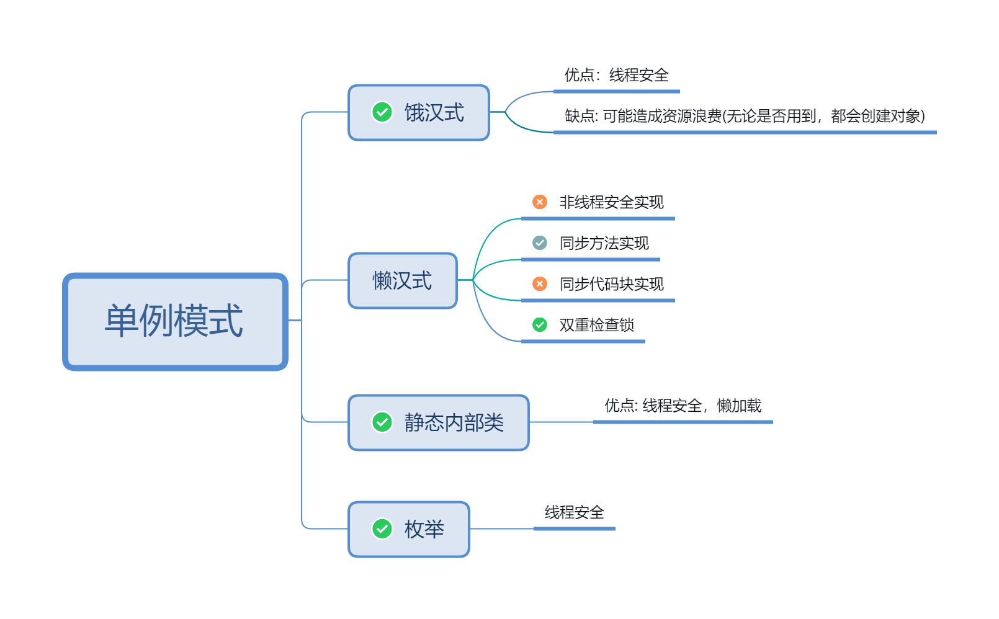
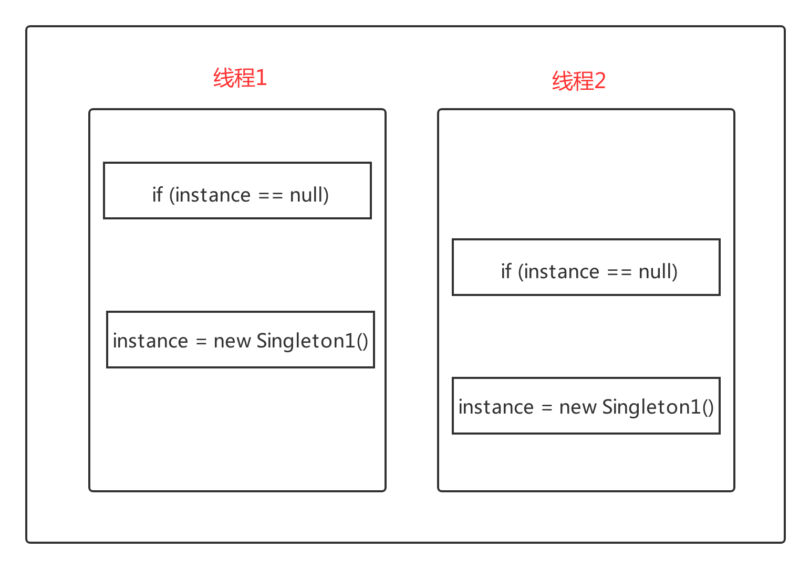

   > 什么时候使用单例模式
  1. 单例模式保证了内存中该类对象只有一个，对于一些需要频繁创建销毁的对象
 2. 创建对象需要消耗过多资源（既重量级对象），但又经常用到的对象，工具类对象，频繁访问数据库或文件的对象（数据源，session工厂等）
  

### 动机
* 在软件系统中，经常又一些特殊的类，必须保证他们再系统中只存在一个实例，才能保证他们的逻辑正确性，以及良好的效率
* 如何绕过常规的构造器，提供以中机制保证一个类只有一个实例？
* 这应该是类设计的责任，而不是使用者的责任

### 模式定义
确保类只有一个实例，并提供全局访问点。
1. 饿汉式【静态常量】
   优点：类装在时候完成实例化，避免了多线程问题
    缺点：可能造成内存浪费
2. 饿汉式【静态代码块】

3. 懒汉式【非线程安全】
  

  优点： 懒加载
  缺点：非线程安全
4. 懒汉式【线程安全，同步方法】
  优点：线程安全
  缺点：只创建一次对象，但是每次调用都要同步方法，效率低。
5. 懒汉式【线程安全，同步代码块】
  缺点：不能保证线程安全
6. 双重检查锁DCL
  特点：内存读写reorder，但由于内存可见性有问题，使用volatile修饰变量
  优点: 懒加载，线程安全
  缺点：
7. 静态内部类
  优点：懒加载
8. 枚举

### 要点总结
*  SIngleton模式中的实力构造器可以设置为protected以允许字类派生
*  Singleton模式一般不要支持拷贝构造函数和clone接口，因为这有可能导致多个对象实例，与Singleton模式的初衷违背。
*  如何实现多线程环境下安全的Singleton，注意对双重检查锁的正确实现