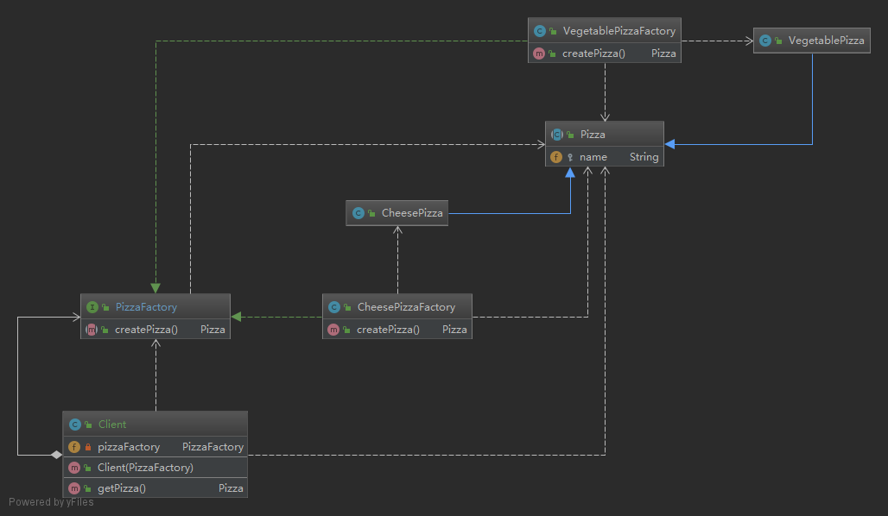

###  动机

在软件系统中，经常面临着对象创建工作；由于需求的变化，需要创建的对象的具体类型经常变化。

 如果应对这种变化？如何绕过常规的对象创建方法，提供一种“封装机制”来避免客户程序和这种“具体对象创建工作”的紧密耦合？

### 模式定义

 定义一个用户创建对象的接口，让子类决定实例化哪一个类。工厂方法使得一个类的实例化延迟到子类。【目的：解耦， 手段：接口、抽象类】

类图：



说明：

- Client为要使用Pizza对象的客户端类,；通过注入的接口PizzaFactory的具体实现类来创建Pizza对象， 整个对象创建过程不依赖具体的Pizza类，由初始化的PizzaFactory对象来决定创建的是那个对象。
- 所有的资源类都要实现Pizza接口
- 定义一个PizzaFactory的接口类， 每一种具体的资源类都依赖于一个实现了PizzaFactory接口的工厂类

### 代码实现

- 相关资源类， 为了便于理解所有的类中没有过多涉及与实现

```java
/**
 * 披萨的父类
 *
 * @author Jann Lee
 * @date 2019-07-28 23:06
 **/
public abstract class Pizza {
    protected String  name;

    public String getName() {
        return name;
    }

    public void setName(String name) {
        this.name = name;
    }
}
/**********************************************************************************************/
/**
 * 芝士披萨类
 *
 * @author Jann Lee
 * @date 2019-07-28 23:01
 **/
public class CheesePizza extends Pizza {
    public CheesePizza() {
        super.name = "芝士披萨";
    }
}
/**
 * 蔬菜披萨
 * @author Jann Lee
 * @date 2019-07-28 23:03
 **/
public class VegetablePizza extends Pizza {
     public VegetablePizza() {
        super.name = "蔬菜披萨";
    }
}
```

- 相关工厂类

```java
/**
 * Pizza工厂的接口类
 *
 * @author Jann Lee
 * @date 2019-07-28 23:11
 **/
public interface PizzaFactory {
    Pizza createPizza();
}


/**
 * 蔬菜pizza工厂类
 *
 * @author Jann Lee
 * @date 2019-07-28 23:14
 **/
public class VegetablePizzaFactory implements PizzaFactory {

    @Override
    public Pizza createPizza() {
        return new VegetablePizza();
    }
}

/**
 * 芝士pizza的工厂类， 用来创建芝士pizza
 *
 * @author Jann Lee
 * @date 2019-07-28 23:12
 **/
public class CheesePizzaFactory implements PizzaFactory {
    @Override
    public Pizza createPizza() {
        return  new CheesePizza();
    }
}

```

- 需要创建对象的客户端

```java
/**
 * 工厂方法测试
 *
 * @author Jann Lee
 * @date 2019-07-28 23:00
 **/
public class Client {
    private PizzaFactory pizzaFactory;

    public Client(PizzaFactory pizzaFactory) {
        this.pizzaFactory = pizzaFactory;
    }

    public Pizza getPizza(){
        return pizzaFactory.createPizza();
    }
}
```

### 要点总结

- FactoryMethod用于隔离类对象的使用者和具体类型之间的耦合关系。面对一个经常变化的具体类型，紧耦合关系会导致软件的脆弱
- 通过面向对象的手法，将所要创建的具体对象工作延迟到子类，从而实现一种扩展（而非更改）的策略，较好的解决了这种紧耦合关系。
- 解决“单个对象”的需求变化。缺点在于要求创建方法/ 参数相同