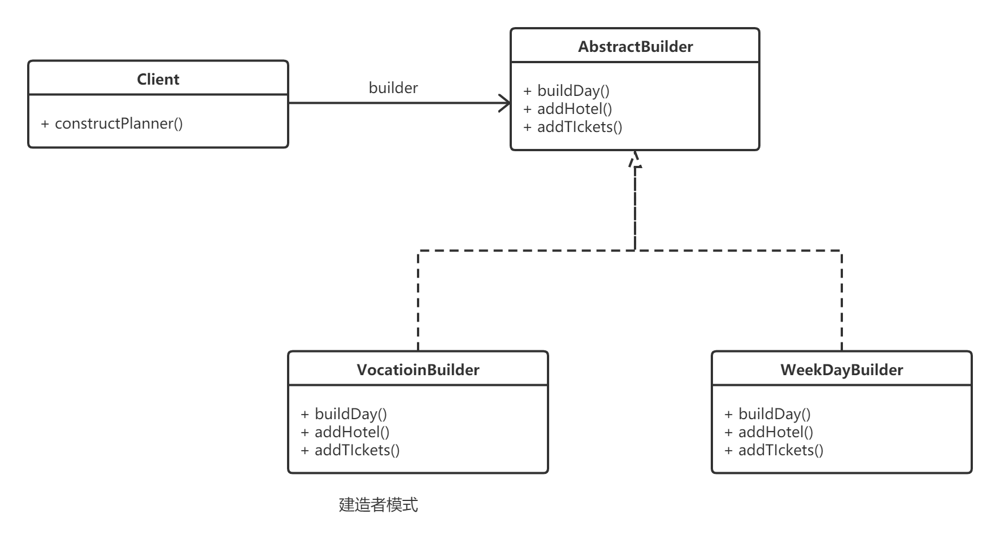

## 构建器模式

**它是‘对象创建’模式**

#### 动机（Motivation)

* 在软件系统中，有时候面临着“一个复杂对象”的创建工作， 其通常有各个子对象用一定算法构成；由于需求变化， 这个复杂对象的各个部分经常面临着剧烈的变化， 但是将他们组合在一起的算法却相对稳定。
* 如何应对这种变化？如何提供一种封装机制来个里出“复杂对象的各个部分”的变化， 从而保持系统中的“稳定构建算法”不随着需求改变而改变？

#### 模式定义

将一个复杂对象的构建与其表示相分离， 是的同样构建过程（稳定）可以创建不同的表示（变化）。

#### 要点总结

* Builder模式主要用于“分步骤构建一个复杂的对象”。在其中”分步骤“是一个稳定的算法，而复杂对象的各个部分则经常变化。
* 变化点在哪里，封装哪里---Builder模式主要在于应对“复杂对象各个部分”的频繁需求变动。其缺点在于难以应对“分步骤构建算法”的需求变动。

