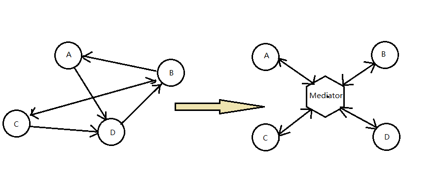

## 动机
* 在软件构建过程中，经常会出现多个对象互相关联交互的情况，对象之间常常会维持一种负责的引用关系，如果遇到一种需求的更改， 这话总直接的医用关系将面临不断的变化。
*在这种情况喜爱，我们可使用一个中介对象来管理对象间的关联关系，避免相互交互的对之间的紧耦合引用关系，从而更好地低于变化。
  

## 要点总结
* 将多个对象间的关联关系解耦， Mediator模式将多个对象控制进行集中管理，变“多个对象相互关联”为多个对象和一个中介者关联"， 简化了系统的维护，抵御了可能的变化。

* 随着控制逻辑的复杂化， Mediator具体对象的实现可能相当复杂。这时候可以对Mediator对象进行分解处理。
* F对象之间（双向）的关联关系。acade模式时解耦系统间（单向）的对象关联关系；Mediator模式时解耦系统内部各个