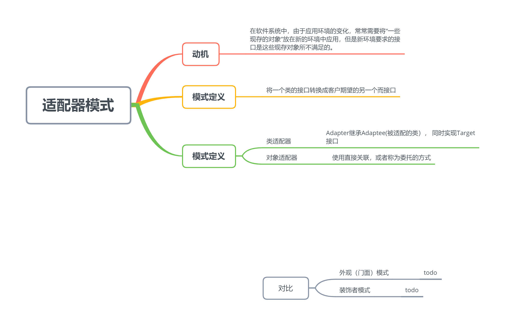
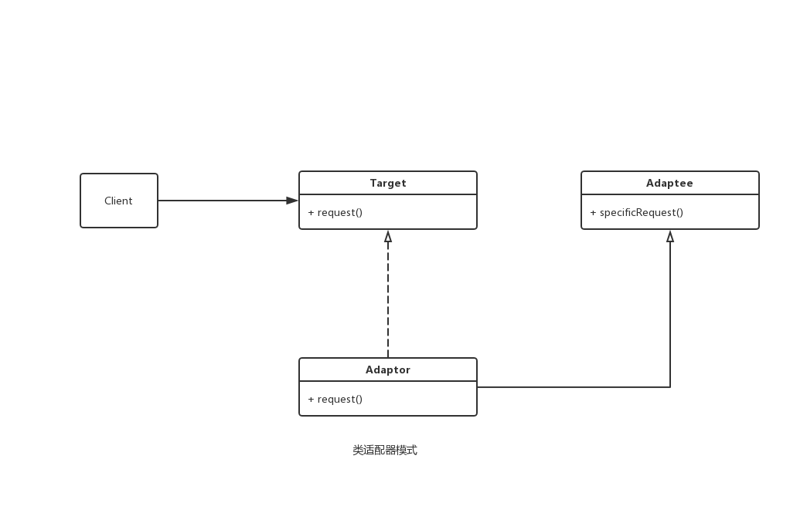

  

## 类
  

  

 
## 优点
提高类的透明性和复用，现有的类复用但不需要改变
母音表类和适配器解耦，提高程序扩展性
## 缺点
增加代码复杂度
代码可读性变差

## 与其他设计模式对比
** 适配器模式&装饰者模式 ** 
适配器模式为了兼容其他需求
装饰者模式是为了扩展功能

** 适配器模式&外观模式 **
* 都是对现有的类封装
* 外观模式定义了新的接口，而适配器模式复用一个原有的接口
* 适配器模式使两个已有的模式协同工作；外观模式在现有基础上提供一个更为方便的访问入口
* 外观模式用来适配相关子系统， 适配器模式用来适配类之间的。
